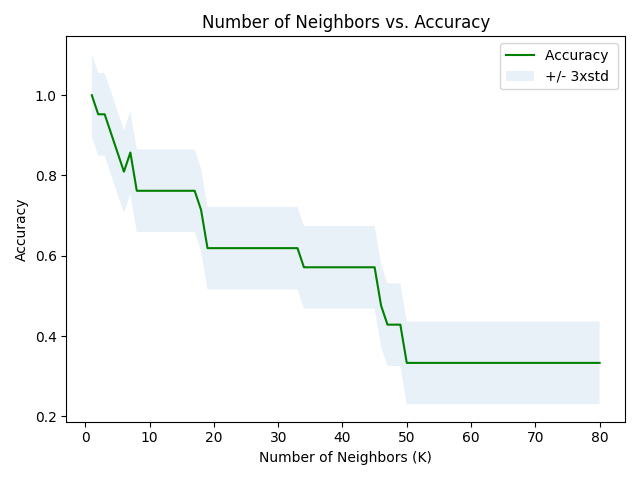

## Summary

The data set we will be using is Zoo [@zoo-data] provided by UC Irvine Machine Learning Repository. It stores data with 7 classes of animals and their related characteristics including animal name, hair, feathers and other attributes. In this project, we will use classification as our method to predict a most likely type of a given animal.

## Introduction

The earth is an amazing planet that cultivates branches of animals. In general, scholars split them into 12 classes including mammals, birds, reptiles, amphibians, fishes, insects, crustaceans, arachnids, echinoderms, worms, mollusks and sponges[@types-of-animals]. The traditional way in animal classification is manually identifying the characteristics and attributing it the mostly close class [@animal-classification]. However, it is tedious and time consuming, especially when the data set is very huge. A question hereby comes to us, if we can apply K-nearest neighbors (KNN) algorithms in predicting the type an animal belongs to given its related characteristics, such as hair, feathers, etc.? Therefore, in this project, we will show how we use KNN to do classification in animals based on data set [@zoo-data] which contains 1 categorical attribute, 17 Boolean-valued attributes and 1 numerical attribute. The categorical attribute appears to be the class attribute. Detailed breakdowns are as follows:

animal name: Unique for each instance
hair: Boolean
feathers: Boolean
eggs: Boolean
milk: Boolean
airborne: Boolean
aquatic: Boolean
predator: Boolean
toothed: Boolean
backbone: Boolean
breathes: Boolean
venomous: Boolean
fins: Boolean
legs: Numeric (set of values: {0,2,4,5,6,8})
tail: Boolean
domestic: Boolean
catsize: Boolean
type: Numeric (integer values in range [1,7])

## Methods & Results

We are going to use multiple analysis to classify the type of the animals using 16 variables including hair, feathers, eggs, milk, airborne, aquatic, predator, toothed, backbone, breathes, venomous, fins, legs, tail, domestic, catsize as our predictors. To predict the class of a new observation, the algorithms of each type will be further explained before implementation.

```{r setup, include=FALSE}
knitr::opts_chunk$set(echo = FALSE)
library(knitr)
library(tidyverse)
library(reticulate)
```

```{python, include=FALSE}
from sklearn.model_selection import train_test_split, GridSearchCV
import numpy as np
from sklearn.neighbors import KNeighborsClassifier
from sklearn.tree import DecisionTreeClassifier
```


The first thing is to import the data. The data set is downloaded from [UCI repository]("https://archive-beta.ics.uci.edu/ml/datasets/zoo"). It is then saved as a csv file in this project repository. Some exploratory data analysis needs to be run before running the actual analyses on the data set.

```{r read-data, echo=FALSE, message = FALSE}
data = read_csv("../results/csv/head.csv")
knitr::kable(data, caption = "zoo data")
```

After checking whether there are missing values in the data set, we can clearly deduce that the data set is clean according to the data summary we generated above. Since most features are binary and categorical, there is no need to do normalization and standardization.

```{r data-visualization, echo=FALSE, fig.cap="Histogram of all features", out.width = '75%', out.height="75%"}

```

As shown in Fig \@ref(fig:data-visualization), the histograms of each feature are generated. The ones with skewed distribution might be more decisive in the prediction. However, since the data set is relatively small, all the features except the animalName are going to be used to predict. In the next part, we are going to split the data, into the training set and testing set. After that, different classification models will be trained and evaluated.

### Classification
Now we will use the training set to build an accurate model, whereas the testing set is used to report the accuracy of the models. Here is a list of algorithms we will use in the following section:

K Nearest Neighbor(KNN) 
Decision Tree 
Support Vector Machine 
Logistic Regression


### KNN
KNN captures the idea of similarity (sometimes called distance, proximity, or closeness) with some basic mathematics we might have learned earlier. Basically in terms of geometry we can always calculate the distance between points on a graph. Similarly, using KNN we can group similar points together and predict the target with our feature variables(x).

First of all, we have to train the model for different set of K values and finding the best K value.
Then we want to plot the accuracy for different K values.

```{r k-accuracy, echo=FALSE, fig.cap= "Number of Neighbors vs. Accuracy", out.width = '100%'}

```
The best accuracy was with the values 1.0 when k = 1.


### KNN final model & Evaluation
As the best accuracy was with K = 1, by using K = 1 for the final KNN model the final KNN model is built in the following.

```{r knn-evaluation, echo=FALSE, message = FALSE}
knn_cross_validate_result = read_csv("../results/csv/knn_cross_validate_result.csv")
knitr::kable(knn_cross_validate_result, caption = "cross validate result of knn")
```

```{r knn-report, echo=FALSE, message = FALSE}
knn_classification_report = read_csv("../results/csv/knn_classification_report.csv")
knitr::kable(knn_classification_report, caption = "classification report of knn")
```

### Decision Tree

A decision tree is a decision support tool that uses a tree-like model of decisions and their possible consequences, including chance event outcomes, resource costs, and utility The goal of using a Decision Tree is to create a training model that can use to predict the class or value of the target variable by learning simple decision rules inferred from prior data(training data).


```{r dt-accuracy, echo=FALSE, fig.cap= "Max Depth vs. Accuracy", out.width = '100%'}
knitr::include_graphics("../results/figures/dt_accuracy.png")
```
The best accuracy was with value 0.9047619047619048 with maximum depth = 5.

### Decision Tree final model & evaluation
As the best accuracy takes place when the max depth is 5. Using max depth = 5 for the final decision tree we can get the following result.

```{r dt-evaluation, echo=FALSE, message = FALSE}
dt_validate = read_csv("../results/csv/dt_cross_validate_result.csv")
knitr::kable(dt_validate, caption = "cross validate result of decision tree")
```

```{r dt-report, echo=FALSE, message = FALSE}
dt_classification_report = read_csv("../results/csv/dt_classification_report.csv")
knitr::kable(dt_classification_report, caption = "classification report of decision tree")
```

### Support Vector Machine

SVM or Support Vector Machine is a linear model for classification and regression problems. It can solve linear and non-linear problems and work well for many practical problems. The idea of SVM is simple: The algorithm creates a line or a hyperplane which separates the data into classes[@towards-dsci].

Final SVM is here used the splited test part to train again for better training, and better prediction. An svm evaluation as well as the final model is also provided below.

```{r svm-evaluation, echo=FALSE, message = FALSE}
svm_classification = read_csv("../results/csv/svm_classification_report.csv")
knitr::kable(svm_classification, caption = "classification report of support vector machine")
```

### Logistic Regression
Logistic Regression is a "Supervised machine learning" algorithm that can be used to model the probability of a certain class or event. It is used when the data is linearly separable and the outcome is binary or dichotomous in nature. That means Logistic regression is usually used for Binary classification problems[@ibm-dsci].

### Logistic Regression training model Jaccard Score, final model and evaluation
Final LR model is here used the splited test part to train again for better training, and better prediction. The LR evaluation also down here.

```{r lr-evaluation, echo=FALSE, message = FALSE}
lr_classification = read_csv("../results/csv/lr_classification_report.csv")
knitr::kable(lr_classification, caption = "classification report of logistic regression")
```
## Discussion

After analyzing all the different 4 models K Nearest Neighbor(KNN), Decision Tree, Support Vector Machine and Logistic Regression, we found KNN is best to predict the animal type here. As you have seen in the model evaluation tables before, for accuracy KNN is the best, the second-best is decision tree method and following by Support Vector Machine and Logistic Regression. The result of KNN was expected as KNN is the best in grouping similar data points together and giving the best prediction results. Predicting the correct animal type with the highest accuracy have a huge impact on identifying animal types. These models can be used to identify animal types instantly for example if someone saw/discovered an animal and the type is not identified then they can feed all the characteristics fields to the model. The model can predict the animal type accurately, which is way more accurate than identifying and classifying the animal based on common sense. Thus our model can increase the research potential in many fields but not just limited to Marine Science, Animal Science, Forestry, and etc. This might lead to a future question in which how we are going to maintain the accuracy of predictions when working with more diverse groups of animals. Another possible aspect of this can be how some attributes of animals will relate to each other, for instance, relation between animals which has teeth vs predator. Furthermore, how we are going to use those relations to predict behaviors and attributes of newly discovered animals and how we are going to make our perceptions on animals even more detailed. These models and their advancements will not only widen our knowledge in terms of animal biology but will also let us find all other possible relations within the nature in a much more efficient way.

## Reference